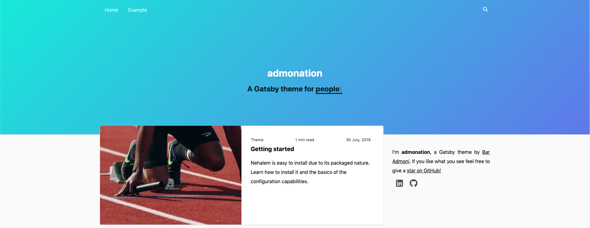

# Admonation Gatsby Theme


**admonation** is a beautiful Gatsby theme for blogging.



> TODO: Create a demo

## Features

Out-of-the-box:

-   Fully responsive
-   Highly optimized (Lighthouse score ~400)
-   SEO optimized (with open graph, Twitter Card, JSON-LD, RSS, robots.txt and sitemap)
-   PWA
-   Syntax highlighting
-   Search functionality
-   Multi navigations
-   Static pages
-   Fully typed with TypeScript
-   Tagging
-   Theming
-   Customizable

## Installation

> TODO: Create a starter for a quick start!

This is the mono repo containing the demo **and** the theme. Check the [theme-specific README](theme/README.md) for further
details on the theme.

In case you want to work with this mono repo (for local development, pull requests, etc.):

```bash
git clone https://github.com/baradm100/gatsby-theme-admonation.git
cd gatsby-theme-admoni/theme
npm install
cd ../demo
npm run update:theme
npm install
```

## Documentation

TODO

### Site Metadata

See the full site metadata [here](./theme/gatsby-config.js#19)

#### title

The site's title (will be shown in the title and in the SEO)

**Default value**: `admonation`

#### siteUrl

The site's url (will be shown in SEO)

**Default value**: `https://nehalem.netlify.com`

#### description

The site's description (will be shown in SEO and in the header)

**Default value**: `A Gatsby theme for %TOPICS%`

**Notes**:

-   The `%TOPICS%` will be replaced in with the site's topics

#### topics

The site's topics (will be shown in SEO and in the header with fancy typing animation)

**Default value**:

```javascript
[`bloggers`, `geeks`, `nerds`, `people`, `everyone`];
```

#### menu

The items that will be shown in the upper navigation menu

**Default value**:

```javascript
[
    {
        name: 'Home',
        path: '/',
    },
    {
        name: 'Archive',
        path: '/archive',
    },
    {
        name: 'Tags',
        path: '/tags',
    },
];
```

#### footerMenu

The items that will be shown in the footer menu

**Default value**:

```javascript
[
    {
        name: 'RSS',
        path: '/rss.xml',
    },
    {
        name: 'Sitemap',
        path: '/sitemap.xml',
    },
];
```

#### search

If need to show the search feature

**Default value**: `true`

#### showFeaturedTags

If need to show the featured tags

**Default value**: `true`

#### author

The author details

**Default value**:

```javascript
{
    name: `baradm100`,
    description: `I'm <strong>admonation</strong>, a Gatsby theme by
    <a href="https://github.com/baradm100" rel="noopener" target="_blank">Bar Admoni</a>. If you like what you see feel free to give a
    <a href="https://github.com/baradm100/gatsby-theme-admonation" rel="noopener" target="_blank">star on GitHub!</a>`,
    social: {
        facebook: ``,
        twitter: ``,
        linkedin: `https://www.linkedin.com/in/bar-admoni/`,
        instagram: ``,
        youtube: ``,
        github: `https://github.com/baradm100`,
        twitch: ``,
    }
}
```

### Plugin Options

See the full plugin options [here](./theme/gatsby-config.js#9)

#### manifest

Information for the manifest file (the manifest plugin [document](https://github.com/gatsbyjs/gatsby/tree/HEAD/packages/gatsby-plugin-manifest#how-to-use))

**Default value**:

```javascript
{
    name: `admonation - A Gatsby theme`,
    short_name: `admonation`,
    start_url: `/`,
    background_color: `#a4cbb8`,
    theme_color: `#a4cbb8`,
    display: `minimal-ui`,
    icon: `${__dirname}/assets/logo.png`,
}
```

## Author

Developed by [nehalist.io](https://nehalist.io) and modified by [Bar Admoni](https://github.com/baradm100).
